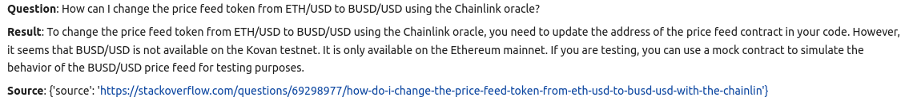
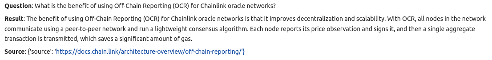

# Chainlink Assistant

This is a collection of LLM programs for a personalized AI assistant that is driven by Chainlink’s publicly-available developer resources: 

* [Chainlink Developer Docs](https://docs.chain.link/getting-started/conceptual-overview)
* [Chainlink Tags on Stack Overflow](https://stackoverflow.com/questions/tagged/chainlink)
* [Chainlink Academy](https://chainlink.education/)

Our goal is to improve the productivity of developers that are building with Chainlink infrastructure. Many developers already use ChatGPT, but this is a general model that (i) often outputs instructions that are out of date, (ii) isn’t specialized towards developing on top of Chainlink. 

We use a recent approach to personalizing AI assistants, called in-context retrieval-augmented language models (see research overview here), which has the advantage of citing sources and reducing hallucination (making stuff up).

You can find further details of the project in this [doc](https://docs.google.com/document/d/1KledT3tFueBkgaTI19K_3I2OXIGf4CtR0Hc5gwXIgR0/edit?usp=sharing).

# What's in this Repo?

## Data

We have scraped various data sources relevent to Chainlink development such as the [Chainlink Developer Docs](https://docs.chain.link/getting-started/conceptual-overview), [Chainlink Tags on Stack Overflow](https://stackoverflow.com/questions/tagged/chainlink) and [Chainlink Academy](https://chainlink.education/). We run this text through the OpenAI embedding model and store it in a vector db. This data can be found in the `algovate/data` folder e.g. `documents.pkl`.

## LLM Assistants

We have experimented with a variety of LLM assistants using LLM programming approaches like LLM workflows/chains and agents, with frameworks such as LangChain and Llama Index. These LLM assistants use a variety of retrieval methods (e.g. vector-based retrieval), logic and models (e.g. the new 16k token context window model from OpenAI). These can be found in the `algovate/langchain` and `algovate/llama` dirs, and notebooks.

## Database of Questions & Answers

We test the performance of the Chainlink assistants using databases of `question` and `answer` pairs. These Q&As may be inspected in the `auto_eval_pairs_v*.csv` files, which can be found in the `algovate/data` folder. Some of these files are generated by humans, and some are auto-generated by LLMs. The human-generated questions were chosen to test the performance of the code according to certain requirements (e.g. to make sure that it outputs relevant code, or can retrieve values from tables) For the auto-generated Q&As, we pass data from the various Chainlink resourses to GPT and ask it to generate a relevant question and answer. The same questions are then be asked to the Chainlink assistant app. 

## Testing Scripts & Notebooks

Various testing scripts and notebooks can be found in the `test_*` dirs. The scripts and notebooks for testing the Chainlink assistants against the databases of Q&As can be found in the `test_chainlink` dir. We have also created notebooks to aid in reviewing the questions and results. 

# Evaluate Results

If you just want to evaluate existing Q&A results (without re-running the assistants on the Q&A database), do the following:

```console
# Clone the repository.
git clone https://github.com/algoveraai/chainlink-assistant.git
cd chainlink-assistant

# Install libraries
pip install jupyterlab
pip install pandas

# Run Jupyter Lab
jupyter lab
```

Once Jupyter opens in the browser, navigate to `test_chainlink/view_results.ipynb` and run all cells. The widget will allow you to iterate one-by-one through each Question, and the corresponding Answer outputted by the Chainlink Assistant. Where relevant, it will also display the source the AI-generated questions were created from. You can mark the answers as correct or incorrect if you want, or just iterate through without marking. 

## Example Results

Example AI-generated question from Stack Overflow (with source):



Example AI-generated question from Developer Docs:




# Re-Run the Assistants on the Q&A Database

To install:

```console
# Clone the repository.
git clone https://github.com/algoveraai/chainlink-assistant.git
cd chainlink-assistant

# Initialize virtual environment and activate it.
python3 -m venv venv
source venv/bin/activate

# Install the required packages.
pip install -r requirements.txt

# Install the library.
pip install -e .

```

How to re-run the experiments coming soon. 

# Interact with the Chainlink Assistant live through the Frontend

Coming soon!